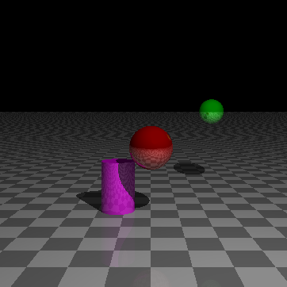

# miniRT (42)

Small ray tracer written with MiniLibX for 42 school. Written in a group together with https://github.com/michaela811.

<p align="center">
  
</p>

> Mandatory and bonus share the **same code paths**; bonus behaviour is toggled at runtime by the executable name. We keep a doubled file layout to satisfy 42’s project rules.

## Table of contents
- [About](#about)
- [Submodules](#submodules)
- [Features](#features)
- [Build](#build)
- [Usage](#usage)
- [Scene (`.rt`) quick reference](#scene-rt-quick-reference)
- [Bonus switch (how it works)](#bonus-switch-how-it-works)
- [Credits](#credits)

## About
`miniRT` is a minimal ray tracer that renders basic geometric objects with lighting and shadows. It uses **MiniLibX** for windowing and image output, **libft** for common utilities, and **get_next_line** for streaming scene parsing. The project was developed as part of the **42** curriculum.

- **Language:** C (42 Norm compliant)
- **Platform:** Linux (MiniLibX X11). macOS can work with the usual MLX flags (not the default here).

---

## 🔌 Submodules

This repo uses three git submodules:

- **libft** → `lib/libft`  
- **get_next_line** → `lib/getnextline` (uses **bonus** sources inside `gnl_bonus/`)  
- **minilibx-linux** → `lib/minilibx_linux` (MiniLibX is a small graphics lib used in 42 projects - an abstraction of the “X Window System” for Unix platforms)

### Clone with submodules

```bash
git clone --recurse-submodules https://github.com/grignetta/miniRT.git miniRT
# or, if you already cloned:
git submodule update --init --recursive
```

### Update submodules later

```bash
git submodule update --remote --merge
```
---

## Features
### Mandatory
- Camera with FOV
- Basic geometric primitives: **sphere**, **plane**, **cylinder**
- Scene parser from a `.rt` file
- Per-pixel ray casting & intersections
- Light: ambient(`A`) and point lighting(`L`)
- Window handling: closure on `ESC`, clicking on a cross, Ctrl+C

### Bonus (runtime toggle)
> Code is shared; bonus effects activate when running the `miniRT_bonus` executable (see [Bonus switch](#bonus-switch-how-it-works)).

- **Material**: matte / glossy (specular highlights)
- **Mirror reflections**
- **Shadows** (hard shadowing)
- **Light types**: additional directional light (`D`)
- **Plane checkered pattern**: (size-controlled chess effect via `get_plane_color`)

---

## Build
### Dependencies (Ubuntu/Debian)
```bash
sudo apt update
sudo apt install -y build-essential xorg-dev libbsd-dev
```

### Clone with submodules
```bash
git clone --recurse-submodules <this-repo-url>
# or, if already cloned
git submodule update --init --recursive
```

### Compile
```bash
make         # builds ./miniRT
make bonus   # builds ./miniRT_bonus
```

> The Makefile builds **libft**, **minilibx_linux**, and compiles **get_next_line** from `lib/getnextline/gnl_mandatory/` into the project.

---

## Usage
Render a scene from a `.rt` file:

```bash
./miniRT scenes/file.rt
# or (bonus runtime features enabled)
./miniRT_bonus scenes/file_bonus.rt
```

Window controls are the usual MLX ones (close the window with the window’s close button; ESC key or Ctrl+C).

---

## Scene (`.rt`) quick reference
The parser follows the classic 42 miniRT subject format. Minimal elements:

- **Ambient light**: `A <ratio> <R,G,B>`
- **Camera**: `C <x,y,z> <nx,ny,nz> <FOV>`
- **Light (point)**: `L <x,y,z> <brightness> <R,G,B>`
- **Sphere**: `sp <x,y,z> <diameter> <R,G,B> [<specular> <reflective>]`
- **Plane**: `pl <x,y,z> <nx,ny,nz> <R,G,B> [<specular> <reflective> <checkered>]`
- **Cylinder**: `cy <x,y,z> <nx,ny,nz> <diameter> <height> <R,G,B> [<specular> <reflective>]`
- **Directional light (bonus)**: `D <nx,ny,nz> <brightness> <R,G,B>`

**Bonus attributes:**
- `<specular>`: recommended **≥ 5** for visible highlights (integer)
- `<reflective>`: **0.0–1.0** (0 = no reflection, 1 = perfect mirror)
- `<checkered>`: **0** = solid color; otherwise size of squares (opposite color computed automatically)

> Bonus scenes are backward-compatible: the mandatory build reads only the required fields and ignores extra bonus values. In bonus mode, missing required bonus data triggers `Invalid input:`.


**Example:**
```rt
A 0.3 200,200,200
C 0.0,0,-7 0,0,0 90
L 2.0,3.0,-2.0 0.8 255,255,255
sp 0.0,-1.0,3 1.2 255,0,0 100 0.5
sp 2.0,0.0,5 0.8 0,255,0 0 0.5
pl 0.0,-3.0,0.0 0.0,1.0,0.0 100,100,100 100 0.1 0.8
cy -1.0,-2.5,4.0 0.0,1.0,0.0 1 2 255,0,255 0 0.3
```

> Colors are `0-255`. Normals are normalized direction vectors. Values are validated by input checks.

---

## Bonus switch (how it works)
Mandatory and bonus compile to **two executables**. At runtime, we detect which one is running:

```c
int is_bonus(char **argv)
{
    if (ft_strcmp(argv[0], "./miniRT_bonus") == 0)
        return (1);
    else
        return (0);
}
```
All bonus-only behaviours (specular highlights, shadows, extra light types, etc.) are gated behind this check.

---

## Credits
- **Authors:** Dari and [michaela811](https://github.com/michaela811)
- **Libraries:** [MiniLibX (Linux)](https://github.com/42Paris/minilibx-linux), libft, get_next_line.
- **Resources:** https://habr.com/ru/articles/342510/
